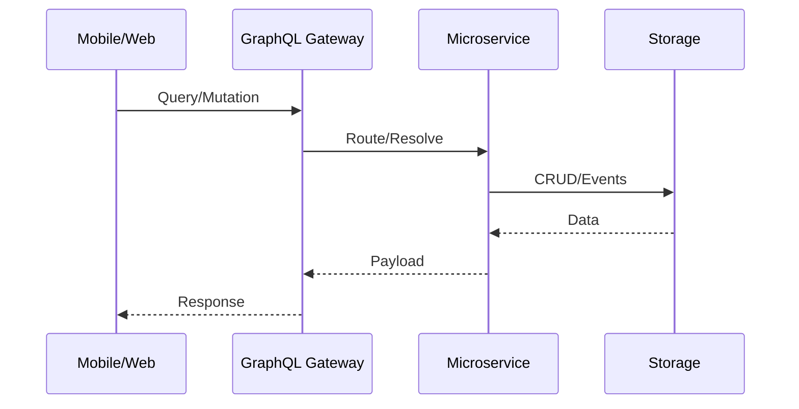

## Thành phần chính

```mermaid
flowchart LR
  subgraph Mobile
    Host
    Checklist
    Keezy
  end
  subgraph Backend[NestJS Monorepo]
    GW(GraphQL Gateway)
    SAuth[svc-user]
    SCore[svc-core]
    GWCust[gw-customer]
    LibCore[lib-core]
    LibUser[lib-user]
  end
  subgraph Admin Web
    CoreAdmin[core_admin]
    FEAdmin[crt.fe.admin]
  end
  subgraph DevOps
    Nginx
    HAProxy
    Redis
    RabbitMQ
    ECS/ECR
  end
  Mobile <--> GW
  Admin Web <--> GW
  GW <--> SAuth
  GW <--> SCore
  GW <--> GWCust
  SAuth <--> LibUser
  SCore <--> LibCore
```

## Backend

- Monorepo NestJS tại `backend/` với apps (gateway, services) và libs dùng chung.
- GraphQL schema tại `backend/schema.gql`, hướng API gateway.

## Admin Web

- `frontend/core_admin` và `frontend/crt.fe.admin`: portal quản trị, codegen, deploy scripts.

## DevOps

- `devops/`: Docker, Nginx/HAProxy, Redis, RabbitMQ, ECS/Terraform.

## Luồng yêu cầu (sequence tổng quan)



