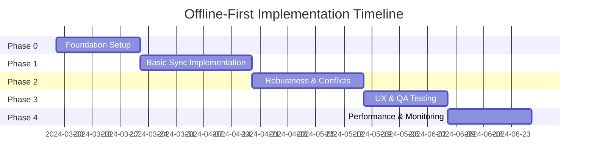

# Offline-First Super App Epic

## Epic Overview

**Epic ID**: `EPIC-OFFLINE-001`  
**Status**: `IN_PROGRESS[]` (Backend Foundation Completed)  
**Priority**: `URGENT[]` (High)  
**Owner**: TBD  
**Start Date**: TBD  
**Target Completion**: TBD

### Description

Implement a comprehensive offline-first architecture for the trackhub super app ecosystem using GraphQL CRUD with local-first data synchronization. This epic enables the app to work seamlessly offline, sync data when connectivity is restored, and handle conflicts gracefully across all mini-apps and services.

### Architecture Overview

**Source of Truth (Client)**: Local DB (WatermelonDB on React Native)  
**Server**: GraphQL CRUD + bulk sync endpoints (pull/push)  
**Sync Pattern**: Outbox (client) + Batching push + Incremental pull (since timestamp/version)  
**Conflict Strategy**: Per-domain rule (default: lastWriteWins for personal data, server merge for collaborative data, manual merge for critical data)  
**Media/Files**: Separate upload (multipart / signed URL) via background uploader queue

### Business Value

- **User Experience**: Full app functionality even when offline or on poor network connections
- **Performance**: Instant UI updates with optimistic rendering
- **Reliability**: No data loss, automatic sync when connectivity restored
- **Scalability**: Efficient bulk sync reduces server load and improves mobile battery life
- **Developer Experience**: Unified sync architecture across all mini-apps in the super app

### Success Metrics

- [ ] 100% of CRUD operations work offline
- [ ] Zero data loss during offline operations
- [ ] < 3s sync latency when connectivity restored (p95)
- [ ] < 5% conflict rate requiring manual resolution
- [ ] < 2% failed sync attempts after retries
- [ ] DB size on device < 100MB for average user
- [ ] Battery impact < 5% additional drain from sync operations

## Epic Breakdown

### Phase 0: Foundation
**Status**: `IN_PROGRESS[]` (Partial - BE-0.1 completed ✅)  
**Dependencies**: None  
**Estimated Effort**: 2-3 weeks

[See Phase 0 Details](./offline-first-phase-0-foundation.md)

### Phase 1: Basic Sync
**Status**: `IN_PROGRESS[]` (Partial - BE-1.3 completed ✅, BE-1.2 backend logic ready)  
**Dependencies**: Phase 0 completed  
**Estimated Effort**: 3-4 weeks

[See Phase 1 Details](./offline-first-phase-1-basic-sync.md)

### Phase 2: Robustness
**Status**: `TODO[]`  
**Dependencies**: Phase 1 completed  
**Estimated Effort**: 3-4 weeks

[See Phase 2 Details](./offline-first-phase-2-robustness.md)

### Phase 3: UX & QA
**Status**: `TODO[]`  
**Dependencies**: Phase 2 completed  
**Estimated Effort**: 2-3 weeks

[See Phase 3 Details](./offline-first-phase-3-ux-qa.md)

### Phase 4: Performance & Monitoring
**Status**: `TODO[]`  
**Dependencies**: Phase 3 completed  
**Estimated Effort**: 2-3 weeks

[See Phase 4 Details](./offline-first-phase-4-performance-monitoring.md)

## Data Conventions (Global)

All entities must follow these conventions:

- **`id: ID!`** - Server canonical id (string UUID, defined in child entities)
- **`clientId: String?`** - Optional temporary id when offline before server returns id (nullable)
- **`version: Int!`** - Required integer, increments on every server update (default: 1)
- **`updatedAt: DateTime?`** - Optional ISO 8601 UTC timestamp (nullable for backward compatibility, but server always sets this)
- **`deletedAt: DateTime?`** - Optional soft delete timestamp (nullable)

**Additional Base Fields** (inherited from `CrtBaseEntity`):
- `status: E_COMMON_STATUS?` - Optional status (ACTIVE, INACTIVE, PUBLIC)
- `spaceId: String?` - Optional space ID
- `rootSpaceId: String?` - Optional root space ID
- `createdAt: DateTime?` - Optional creation timestamp
- `createdBy: String?` - Optional creator user ID
- `updatedBy: String?` - Optional last updater user ID
- `tenantId: String?` - Optional tenant ID
- `projectId: String?` - Optional project ID
- `refProjectId: String?` - Optional reference project ID

**Timestamps**: All timestamps use UTC ISO 8601 format (e.g., `2025-11-05T09:12:34Z`)

**Version Control**: 
- Server always controls `version` - auto-increments on every update/delete
- Client cannot set version directly - server reads current version and increments
- Default `version = 1` for new entities

**Idempotency**: All mutations must be idempotent (use `clientMutationId` or `clientId`)

**Bulk Operations**: Accept arrays and return per-item result with status + conflict info

## GraphQL API Specification

### Core Sync Endpoints

**Query**: `syncPull(entity: String!, since: DateTime, limit: Int = 1000): SyncPullResponse!`

- Incremental pull: get changes since lastSyncAt (cursor/timestamp)
- Returns array of entity objects (server canonical shape)
- Includes `lastSyncAt` server time marker and `hasMore` flag

**Mutation**: `syncPush(entity: String!, items: [JSON!]!): [SyncResultItem!]!`

- Bulk push: accepts array of items as JSON
- Returns per-item `SyncResultItem` with success/error/conflict info
- Maps `clientId` → server `id` on success

### Conflict Resolution

Default strategy per domain:
- **Personal data**: Last write wins
- **Collaborative data**: Server merge
- **Critical data**: Manual merge with UX

## Local DB Schema (WatermelonDB)

### Core Tables

1. **Entity tables** (e.g., `spaces`, `users`, etc.)
   - **Required fields**: `id` (server UUID), `version` (Int, default: 1), `updated_at` (DateTime)
   - **Optional fields**: `client_id` (String, for offline creates), `deleted_at` (DateTime, for soft delete)
   - **Additional base fields**: `status`, `space_id`, `root_space_id`, `created_at`, `created_by`, `updated_by`, `tenant_id`, `project_id`, `ref_project_id`
   - Plus entity-specific fields

2. **`outbox`** (mutation queue)
   - Fields: `id`, `entity`, `payload` (JSON string), `status` (pending/sending/failed/success), `attempts` (Int), `lastError` (String?), `createdAt` (DateTime), `updatedAt` (DateTime)

3. **`uploads`** (media queue)
   - Fields: `id`, `localPath` (String), `remoteUrl` (String?), `status` (String), `attempts` (Int), `meta` (JSON?)

## Dependencies

### External Dependencies
- WatermelonDB library (React Native)
- SQLCipher or encrypted SQLite adapter
- GraphQL backend with bulk sync endpoints
- Storage service for media uploads (S3, Cloud Storage, etc.)

### Internal Dependencies
- ✅ GraphQL schema updates (CrtBaseEntity updated with clientId and version)
- ✅ Backend repository logic (version increment, clientId handling implemented)
- ⏳ Backend sync endpoints implementation (GraphQL syncPull/syncPush endpoints pending)
- ⏳ Mobile app architecture refactoring (WatermelonDB setup pending)
- ⏳ Mini-apps adaptation to offline-first patterns (Pending)

## Risks & Mitigation

| Risk | Impact | Probability | Mitigation |
|------|--------|-------------|------------|
| Data corruption during sync | High | Low | Comprehensive DB migrations, transaction safety |
| Conflict resolution UX confusion | Medium | Medium | Clear UX patterns, auto-merge where possible |
| Performance issues with large datasets | High | Medium | Pagination, indexing, batch size limits |
| Battery drain from sync operations | Medium | Medium | Smart batching, background task optimization |
| Schema evolution breaking sync | High | Medium | Versioned schemas, backward compatibility |
| Network flakiness causing duplicates | Medium | Medium | Idempotency, clientId mapping, deduplication |

## Timeline Overview

## Progress Tracking

**Overall Progress**: ~15% (Backend foundation partially completed)

- [x] Phase 0: Foundation (Partial - BE-0.1 completed ✅)
  - ✅ BE-0.1: Global Data Conventions defined and implemented
- [ ] Phase 1: Basic Sync (Partial - BE-1.3 completed ✅, BE-1.2 backend logic ready)
  - ✅ BE-1.3: Versioning & Timestamp Management implemented
  - ✅ BE-1.2: Backend repository logic for syncPush ready (GraphQL endpoint pending)
- [ ] Phase 2: Robustness
- [ ] Phase 3: UX & QA
- [ ] Phase 4: Performance & Monitoring

### Completed Features ✅

**Backend Base Infrastructure:**
- ✅ Global data conventions defined (clientId, version, updatedAt)
- ✅ CrtBaseEntity updated with Offline-First fields
- ✅ All Prisma base-fields.prisma files updated (3 services)
- ✅ All proto files updated with clientId and version
- ✅ Generate model scripts updated

**Backend Repository Logic:**
- ✅ Auto-increment version in updateOne and deleteOne
- ✅ Server-controlled updatedAt (always uses server time)
- ✅ Idempotent create operations via clientId
- ✅ findOneByClientId method for sync mapping
- ✅ Version increment on soft delete

## Related Documentation

- [Mobile Architecture](../mobile/architecture.md)
- [Data Strategy](../data-strategy.md)
- [Security Documentation](../security.md)
- [Tech Stack](../tech-stack.md)

