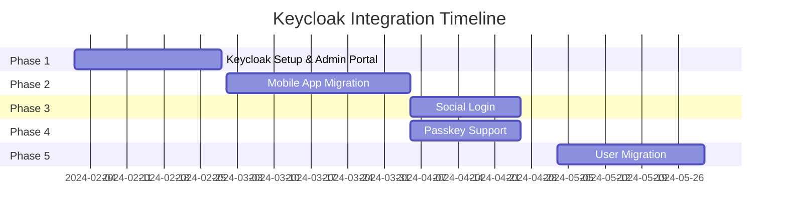

# Keycloak Integration Epic

## Epic Overview

**Epic ID**: `EPIC-KEYCLOAK-001`  
**Status**: `TODO[]` (Planning)  
**Priority**: `URGENT[]` (High)  
**Owner**: TBD  
**Start Date**: TBD  
**Target Completion**: TBD

### Description

Integrate Keycloak as the centralized authentication and authorization service for trackhub ecosystem to support:
- Single Sign-On (SSO) across all applications
- OAuth2/OIDC authentication flows
- Social login (Google, Facebook)
- Passkey/WebAuthn authentication
- Multi-tenant support
- JWT token-based authorization

### Business Value

- **Security**: Centralized, enterprise-grade authentication
- **User Experience**: SSO across mobile app and admin portal
- **Developer Experience**: Reduce custom auth code maintenance
- **Compliance**: Built-in GDPR and security compliance features

### Success Metrics

- [ ] 100% of users migrated to Keycloak authentication
- [ ] SSO working across mobile app and admin portal
- [ ] Social login (Google, Facebook) functional
- [ ] Passkey authentication available
- [ ] Zero authentication-related security incidents
- [ ] < 200ms token validation latency (p95)

## Epics Breakdown

### Phase 1: Keycloak Setup & Admin Portal Integration
**Status**: `TODO[]`  
**Dependencies**: None  
**Estimated Effort**: 3-4 weeks

[See Phase 1 Details](./keycloak-phase-1-admin-portal.md)

### Phase 2: Mobile App Authentication Migration
**Status**: `TODO[]`  
**Dependencies**: Phase 1 completed  
**Estimated Effort**: 4-5 weeks

[See Phase 2 Details](./keycloak-phase-2-mobile-app.md)

### Phase 3: Social Login Integration
**Status**: `TODO[]`  
**Dependencies**: Phase 2 completed  
**Estimated Effort**: 2-3 weeks

[See Phase 3 Details](./keycloak-phase-3-social-login.md)

### Phase 4: Passkey/WebAuthn Support
**Status**: `TODO[]`  
**Dependencies**: Phase 2 completed  
**Estimated Effort**: 2-3 weeks

[See Phase 4 Details](./keycloak-phase-4-passkey.md)

### Phase 5: User Migration & Deprecation
**Status**: `TODO[]`  
**Dependencies**: All previous phases completed  
**Estimated Effort**: 3-4 weeks

[See Phase 5 Details](./keycloak-phase-5-migration.md)

## Dependencies

### External Dependencies
- Keycloak server deployment (Infrastructure team)
- SSL certificates for Keycloak domain
- Google OAuth credentials
- Facebook App credentials

### Internal Dependencies
- Backend NestJS services migration
- Mobile app authentication refactoring
- Admin portal authentication updates

## Risks & Mitigation

| Risk | Impact | Probability | Mitigation |
|------|--------|-------------|------------|
| Keycloak performance issues | High | Medium | Load testing, caching strategy |
| User migration data loss | High | Low | Comprehensive backup, staged migration |
| Mobile OAuth flow complexity | Medium | Medium | Use proven libraries, thorough testing |
| Multi-tenant configuration issues | Medium | Medium | Proof of concept, gradual rollout |
| Breaking changes for existing users | High | Low | Feature flags, parallel running systems |

## Timeline Overview

## Progress Tracking

**Overall Progress**: 0% (0/5 phases completed)

- [ ] Phase 1: Keycloak Setup & Admin Portal Integration
- [ ] Phase 2: Mobile App Authentication Migration
- [ ] Phase 3: Social Login Integration
- [ ] Phase 4: Passkey/WebAuthn Support
- [ ] Phase 5: User Migration & Deprecation

## Related Documentation

- [Keycloak Evaluation](../keycloak-evaluation.md)
- [Security Documentation](../security.md)
- [Architecture Documentation](../architecture.md)

