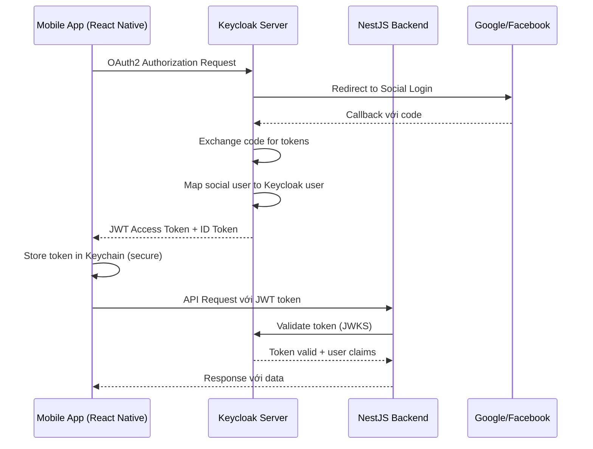
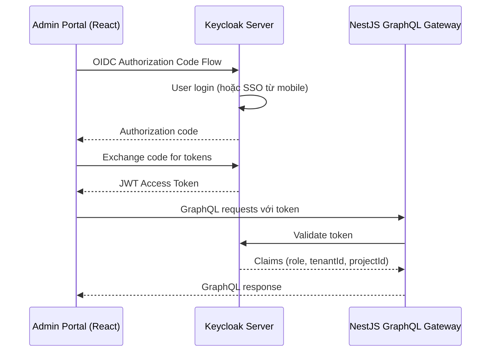
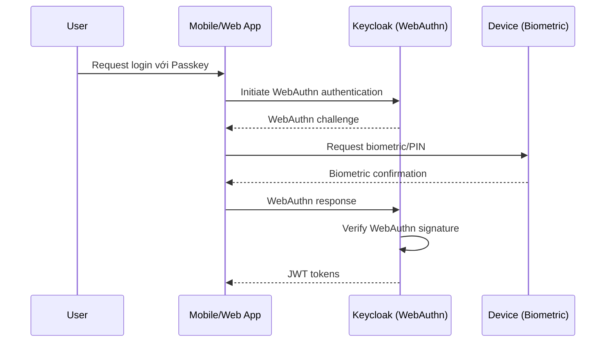

## Tổng quan

Tài liệu này đánh giá tính phù hợp của **Keycloak** để xử lý SSO, OAuth2, và các phương thức xác thực khác (Google, Facebook, Passkey) cho hệ thống trackhub.

## Yêu cầu hiện tại

### 1. Backend (`backend/`)
- **Stack**: NestJS, GraphQL, gRPC microservices
- **Authentication hiện tại**: 
  - Có modules `auth.social` và `auth.socialUser` 
  - Multi-tenant support (tenantId, projectId, spaceId)
  - Chưa có JWT/OAuth2/OIDC implementation hoàn chỉnh
  - Tài liệu ghi "Planned: OAuth2/OIDC + JWT"

### 2. Mobile App (`app/trackhub/`)
- **Stack**: React Native (Super App với mini-apps)
- **Authentication hiện tại**:
  - Custom auth flow với Redux (`authSlice`)
  - GraphQL mutations cho login/register
  - Mock/Local auth service
  - Token lưu trong AsyncStorage (chưa secure)
  - Custom headers: `crt-project-id`, `crt-tenant-id`, `crt-user-id`, `crt-role-id`
  - Có Google login button nhưng chưa implement (TODO comment)

### 3. Admin Portal (`frontend/crt.fe.admin/`)
- **Stack**: React với Apollo Client, GraphQL
- Cần authentication cho admin users

## Tính phù hợp của Keycloak

### ✅ **PHÙ HỢP - Keycloak có thể đáp ứng tốt**

#### 1. **SSO (Single Sign-On)**
- ✅ Keycloak hỗ trợ SSO tốt cho nhiều ứng dụng (mobile app, admin portal)
- ✅ Users đăng nhập một lần, truy cập tất cả services
- ✅ Phù hợp với kiến trúc Super App với nhiều mini-apps

#### 2. **OAuth2/OIDC**
- ✅ Keycloak là OAuth2/OIDC server hoàn chỉnh
- ✅ Hỗ trợ các flows: Authorization Code, Implicit, Client Credentials, Resource Owner Password
- ✅ Phù hợp với kế hoạch "Planned: OAuth2/OIDC + JWT"
- ✅ Tích hợp tốt với NestJS qua `@nestjs/passport` và `passport-openidconnect`

#### 3. **Social Login**
- ✅ Keycloak hỗ trợ Identity Brokering cho Google, Facebook, và 100+ providers khác
- ✅ Giải quyết được TODO "Implement Google OAuth2 login"
- ✅ Cấu hình dễ dàng qua Admin UI
- ✅ Tự động handle token exchange và user mapping

#### 4. **Passkey/WebAuthn**
- ✅ Keycloak 22+ hỗ trợ **WebAuthn/Passkey** authentication
- ✅ Hỗ trợ FIDO2, biometric authentication
- ✅ Phù hợp với xu hướng passwordless authentication

#### 5. **Multi-tenant**
- ✅ Keycloak hỗ trợ **Realms** - mỗi tenant có thể có realm riêng
- ✅ **Organizations** feature (Keycloak 22+) cho multi-tenant tốt hơn
- ✅ Có thể map với `tenantId`, `projectId` hiện tại qua **Custom Attributes** hoặc **Client Scopes**

#### 6. **JWT Tokens**
- ✅ Keycloak issue JWT access tokens và ID tokens
- ✅ Có thể customize claims để include `crt-project-id`, `crt-tenant-id`, `crt-user-id`, `crt-role-id`
- ✅ Token validation built-in qua JWKS endpoint

## Kiến trúc tích hợp đề xuất

### Flow 1: Mobile App Authentication



### Flow 2: Admin Portal Authentication



### Flow 3: Passkey Authentication



## Các thành phần cần tích hợp

### 1. Backend (NestJS)

#### Packages cần thêm:
```json
{
  "@nestjs/passport": "^10.0.0",
  "passport": "^0.7.0",
  "passport-jwt": "^4.0.1",
  "passport-openidconnect": "^0.1.1",
  "jwks-rsa": "^3.1.0"
}
```

#### Module cần tạo:
- `libs/crt.lib.auth/src/keycloak/` - Keycloak integration
- `apps/crt.gw.customer/src/modules/auth/keycloak.guard.ts` - JWT guard
- `apps/crt.gw.customer/src/modules/auth/keycloak.strategy.ts` - Passport strategy

#### Custom Claims Mapping:
Keycloak tokens cần include các claims tương ứng với custom headers hiện tại:
- `crt-project-id` → `projectId` claim
- `crt-tenant-id` → `tenantId` claim  
- `crt-user-id` → `sub` (subject) claim
- `crt-role-id` → `realm_access.roles` hoặc custom claim

### 2. Mobile App (React Native)

#### Packages cần thêm:
```json
{
  "react-native-keycloak": "^1.0.0",
  "@react-native-keychain/react-native-keychain": "^8.1.3",
  "react-native-app-auth": "^7.2.0"
}
```

#### Components cần update:
- `packages/auth/src/services/Auth/GraphQLAuthService.ts` → `KeycloakAuthService.ts`
- `packages/auth/src/screens/SignInScreen.tsx` → Integrate Keycloak OAuth
- `packages/auth/src/providers/AuthProvider.tsx` → Use Keychain thay vì AsyncStorage

#### Secure Token Storage:
- Thay `AsyncStorage` bằng `react-native-keychain`
- Lưu tokens trong Keychain (iOS) / Keystore (Android)

### 3. Admin Portal (React)

#### Packages cần thêm:
```json
{
  "@react-keycloak/web": "^3.0.0",
  "keycloak-js": "^24.0.0"
}
```

#### Components:
- Wrap app với `KeycloakProvider`
- Use `useKeycloak()` hook cho authentication state
- Redirect to Keycloak login page khi chưa authenticated

## Lợi ích khi dùng Keycloak

### 1. **Giảm complexity**
- Không cần tự implement OAuth2/OIDC server
- Không cần handle Google/Facebook OAuth flows manually
- Built-in user management, password policies, MFA

### 2. **Security**
- Best practices về OAuth2/OIDC
- Token rotation, refresh tokens
- Session management
- Brute force protection

### 3. **Features**
- **Adaptive Authentication**: Rules-based authentication flows
- **Account Linking**: Link social accounts với existing users
- **Federated Identities**: SAML, LDAP integration
- **Fine-grained Authorization**: UMA 2.0, Policy-based access control

### 4. **Compliance**
- GDPR compliance features (data export, deletion)
- Audit logs
- Consent management

## Thách thức và giải pháp

### 1. **Multi-tenant phức tạp**
**Thách thức**: Current system có `tenantId`, `projectId`, `spaceId`  
**Giải pháp**:
- Dùng Keycloak Organizations (v22+) hoặc Realms per tenant
- Custom claims/mappers để include tenant context trong tokens
- Backend validate tenant context từ token claims

### 2. **Migration từ custom auth**
**Thách thức**: Đang có custom auth flow với Redux  
**Giải pháp**:
- Gradual migration: Support cả custom auth và Keycloak
- Feature flag để toggle giữa old/new auth
- Migration script để map existing users sang Keycloak

### 3. **Performance**
**Thách thức**: Keycloak là external service  
**Giải pháp**:
- Cache JWKS public keys (không cần call Keycloak mỗi request)
- Use refresh tokens để giảm frequency của auth requests
- Deploy Keycloak gần backend (same VPC/data center)

### 4. **React Native integration**
**Thách thức**: OAuth flow trong mobile app  
**Giải pháp**:
- Dùng `react-native-app-auth` hoặc Keycloak mobile SDK
- Deep linking cho OAuth callbacks
- Custom URL scheme cho app

## Kết luận

### ✅ **Keycloak PHÙ HỢP** với dự án vì:

1. ✅ Đáp ứng đầy đủ yêu cầu: SSO, OAuth2, Social Login, Passkey
2. ✅ Tích hợp tốt với NestJS, React Native, React
3. ✅ Hỗ trợ multi-tenant (Realm/Organizations)
4. ✅ JWT tokens phù hợp với architecture hiện tại
5. ✅ Mature, open-source, active development
6. ✅ Giảm development effort so với tự build

### 📋 **Recommendations**

1. **Phase 1**: Setup Keycloak server, tích hợp với Admin Portal
2. **Phase 2**: Migrate mobile app authentication sang Keycloak
3. **Phase 3**: Enable social login (Google, Facebook)
4. **Phase 4**: Enable Passkey/WebAuthn
5. **Phase 5**: Migrate existing users, deprecate custom auth

### 🔧 **Alternative considerations**

Nếu Keycloak quá nặng hoặc cần self-hosted, có thể xem:
- **Auth0** (SaaS, easier setup, nhưng đắt cho enterprise)
- **AWS Cognito** (nếu đã dùng AWS, nhưng ít features hơn Keycloak)
- **SuperTokens** (lightweight, nhưng ít features hơn Keycloak)

**Kết luận**: Keycloak là lựa chọn tốt nhất cho dự án này vì tính đầy đủ features và khả năng self-host.

