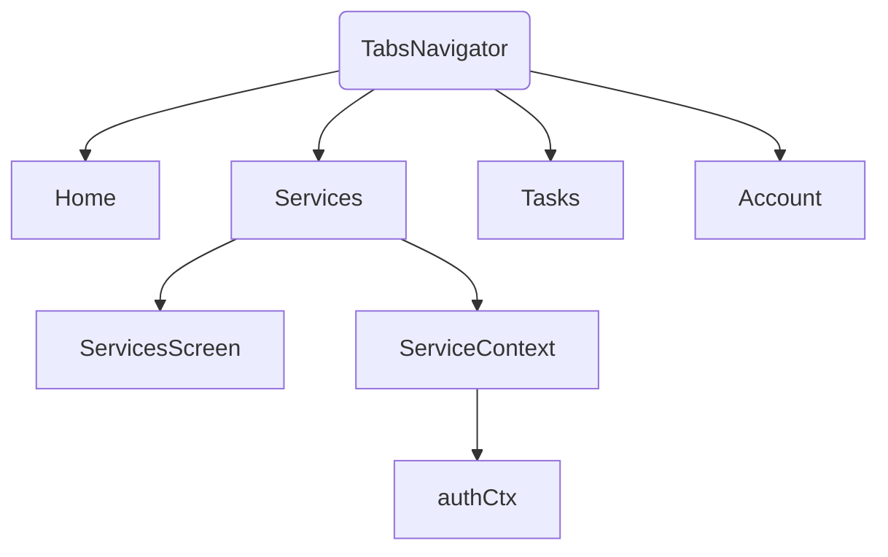
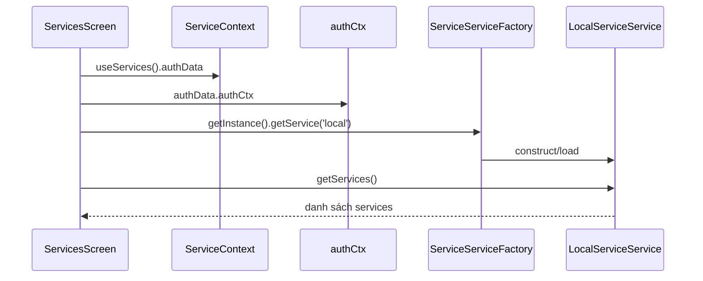

## Module & Navigation

```mermaid
flowchart TD
  Tabs(TabsNavigator) --> Home
  Tabs --> Services
  Tabs --> Tasks
  Tabs --> Account
  Services --> ServicesScreen
  Services --> ServiceContext
  ServiceContext --> authCtx
```

## Dòng dữ liệu hiển thị dịch vụ

```mermaid
sequenceDiagram
  participant UI as ServicesScreen
  participant Ctx as ServiceContext
  participant Auth as authCtx
  participant Fac as ServiceServiceFactory
  participant Svc as LocalServiceService
  UI->>Ctx: useServices().authData
  UI->>Auth: authData.authCtx
  UI->>Fac: getInstance().getService('local')
  Fac->>Svc: construct/load
  UI->>Svc: getServices()
  Svc-->>UI: danh sách services
```

