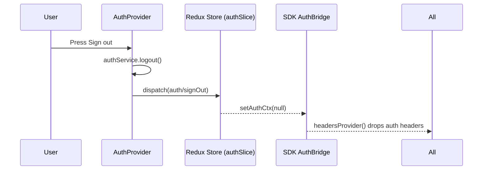
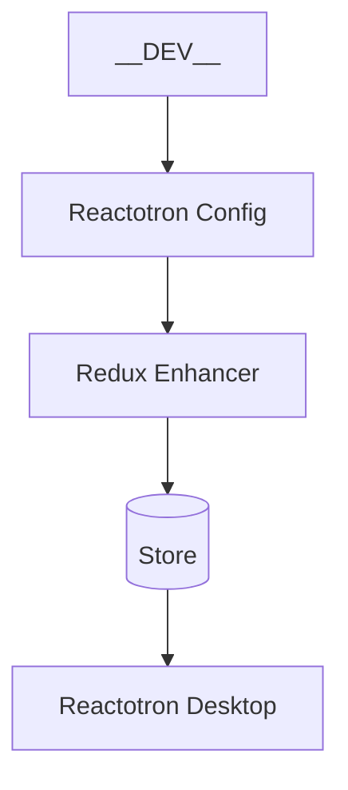

### Overview

This document summarizes how authentication and global state are handled across the Super App Host and all mini apps using a shared Redux store exported from `sdk`. Reactotron is integrated for action/state debugging in development.

### High-level Data Flow

```mermaid
flowchart TD
  U[User taps "Đăng nhập"] --> SIS[SignInScreen]
  SIS --> AP[AuthProvider]
  AP -- dispatch --> AS[Redux: auth/signInSuccess]
  AS --> SL[authSlice updates state]
  SL --> AB[SDK AuthBridge\nsetAuthCtx(ctx)]
  AB --> AH[Auth Headers Provider]
  AH --> AC[Apollo Client]
  AC --> GQL[(GraphQL / REST)]

  style U fill:#fff,stroke:#333
  style AP fill:#FDF6B2,stroke:#333
  style AS fill:#FCE7F3,stroke:#333
  style SL fill:#E0E7FF,stroke:#333
  style AB fill:#D1FAE5,stroke:#333
  style AH fill:#DDD6FE,stroke:#333
  style AC fill:#BBF7D0,stroke:#333
  style GQL fill:#E5E7EB,stroke:#333
```

### Sign-out Flow



### App Composition (Host and Mini Apps)

All apps share the same state shape and initialization contract. Each app wraps its tree with the exported `AppStateProvider` from `sdk`.

```mermaid
flowchart LR
  subgraph Host
    HApp[Host App] --> HProv[AppStateProvider]
    HProv --> HAuth[AuthProvider]
    HAuth --> HNav[React Navigation / Screens]
  end

  subgraph MiniAppA[Mini App (e.g., coreCrt/keezy/sampleCrt)]
    AApp[Mini App] --> AProv[AppStateProvider]
    AProv --> AAuth[AuthProvider]
    AAuth --> ANav[Screens]
  end

  subgraph SDK[Shared SDK]
    Store[createAppStore()] --> Slice[authSlice]
    Slice --> Bridge[AuthBridge]
    Store -.dev.-> Tron[Reactotron Enhancer]
  end

  HProv --- Store
  AProv --- Store
```

### Key Modules

- `sdk/src/state/authSlice.ts`: Holds `auth` state (`isLoading`, `isSignout`, `token`, `authCtx`) and actions: `restoreToken`, `signInSuccess`, `signOut`, `setAuthContext`.
- `sdk/src/state/store.ts`: `createAppStore()` with optional Reactotron enhancer in dev.
- `sdk/src/state/Provider.tsx`: `AppStateProvider` that instantiates and provides the store.
- `sdk/src/auth/AuthBridge.ts`: Bridges current `authCtx` to headers for non-React consumers (Apollo links, REST fetchers).
- `auth/src/providers/AuthProvider.tsx`: Consumes Redux hooks, calls `authService`, dispatches actions, and keeps `AuthBridge` in sync via the slice.

### Reactotron

Reactotron is initialized via `sdk/debug/reactotronConfig` (re-exported by the `sdk` barrel). When available, the store attaches the Reactotron enhancer so you can inspect `auth` actions/state in the desktop app.



### Notes

- The Host and each mini app can run standalone; both use the same `AppStateProvider` and `auth` slice.
- `AuthBridge.headersProvider()` is used by Apollo/REST clients to map `authCtx` into outbound headers.
- Infinite update loops can happen if a component sets state on every render. The current architecture avoids this by dispatching only when `authCtx` changes meaningfully.


