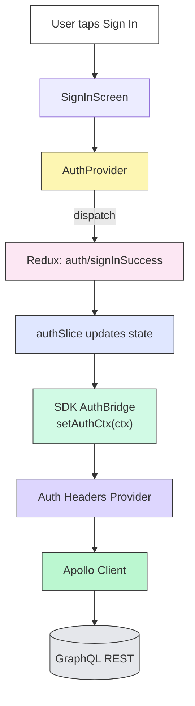
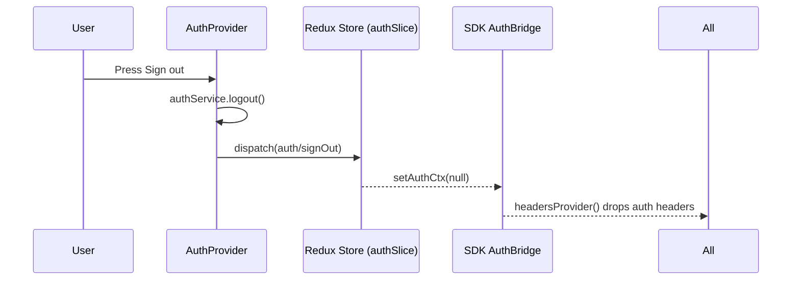
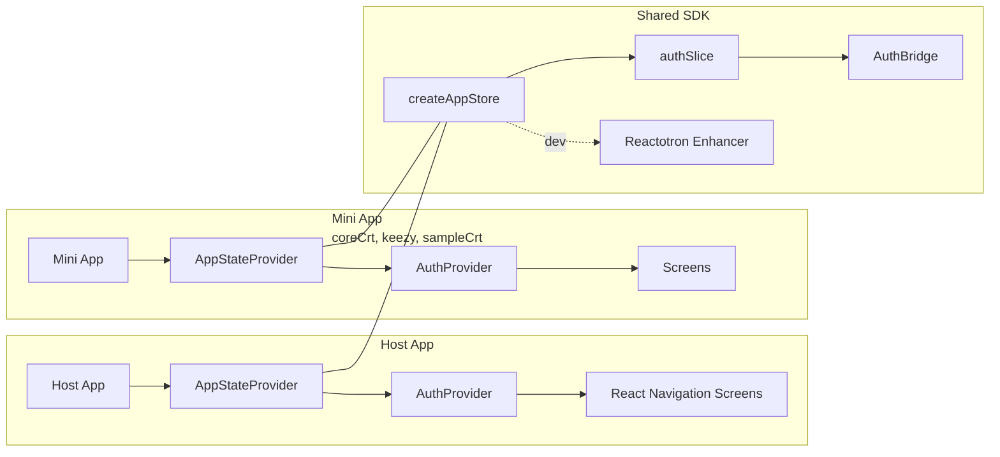
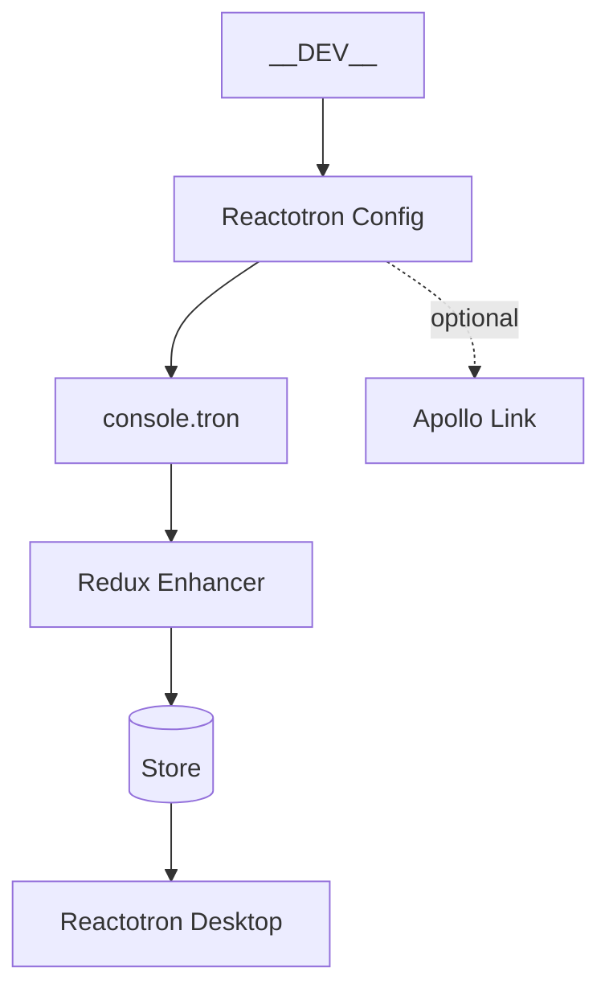

### Overview

This document summarizes how authentication and global state are handled across the Super App Host and all mini apps using a shared Redux store exported from `sdk`. Reactotron is integrated for action/state debugging in development.

### High-level Data Flow

### Sign-out Flow

### App Composition (Host and Mini Apps)

All apps share the same state shape and initialization contract. Each app wraps its tree with the exported `AppStateProvider` from `sdk`.

### Key Modules

- `sdk/src/state/authSlice.ts`: 
  - Holds `auth` state (`isLoading`, `isSignout`, `token`, `authCtx`) 
  - Actions: `restoreToken`, `signInSuccess`, `signOut`, `setAuthContext`
  - Includes `sanitizeCtx()` function to handle circular references, functions, dates, and non-serializable values before storing in Redux
  - Automatically syncs `authCtx` changes to `AuthBridge` via `setAuthCtx()` in reducer middleware

- `sdk/src/state/store.ts`: 
  - `createAppStore()` factory function that creates a Redux store
  - Optional Reactotron enhancer (lazily loaded from `console.tron` if available)
  - Middleware config: `serializableCheck: false` (enabled to support complex context objects)

- `sdk/src/state/Provider.tsx`: 
  - `AppStateProvider` component that instantiates and provides the Redux store
  - Uses `useMemo` to create store once per app instance

- `sdk/src/auth/AuthBridge.ts`: 
  - Maintains global `authCtx` state accessible to non-React consumers
  - `setAuthCtx(ctx)`: Updates the bridge context
  - `getAuthCtx()`: Retrieves current context
  - `buildAuthHeaders()`: Maps `authCtx` to HTTP headers (`crt-project-id`, `crt-tenant-id`, `crt-user-id`, `crt-role-id`, `Authorization`)
  - `headersProvider()`: Convenience wrapper for Apollo header provider
  - Supports multiple context key formats (projectId/projectID/project.id, etc.) for resilience

- `auth/src/providers/AuthProvider.tsx`: 
  - Consumes Redux hooks (`useAppDispatch`, `useAppSelector`)
  - Integrates multiple context sources: `hostCtx`, `checklistCtx`, `keezyCtx`, `authCtx`
  - Uses `stableStringify()` for deep comparison to prevent unnecessary dispatches
  - Merges contexts and dispatches `setAuthContext` when identity fields change
  - Calls `authService` for login/logout/register operations
  - Exposes `AuthContext` with `signIn`, `signOut`, `signUp`, `setChecklistCtx` methods

### Reactotron

Reactotron is configured via `sdk/debug/reactotronConfig` and exported from the `sdk` barrel. The store lazily attaches the Reactotron enhancer when `console.tron` is available.

**Initialization:**
- Config file: `sdk/src/debug/reactotronConfig.ts`
- Connection host: `REACTOTRON_HOST` env var or defaults to `192.168.1.151` (Ubuntu)
- Port: `9090`
- Features: AsyncStorage, Redux integration, networking (with symbolicate URL ignore)
- Automatically creates mock if initialization fails (prevents crashes)

**Usage in Apps:**
- Imported dynamically in host app: `import('sdk').then(m => m.reactotronConfig)`
- Store enhancer is attached automatically when `console.tron.createEnhancer()` exists
- Apollo link integration available via `createReactotronApolloLink()` from `sdk/debug`

### Context Merging Strategy

`AuthProvider` merges multiple context sources to build a unified `authCtx`:
- Contexts are merged in order: `authCtxFromAuth` → `props.authCtx` → `hostCtx` → `checklistCtx` → `keezyCtx` → `auth.authCtx`
- Only dispatches `setAuthContext` when identity fields change (projectId, tenantId, userId, roleId, token)
- Uses `stableStringify()` for deep comparison to detect meaningful changes
- Prevents infinite loops by checking for actual identity presence before updating

### Notes

- The Host and each mini app can run standalone; both use the same `AppStateProvider` and `auth` slice.
- `AuthBridge.buildAuthHeaders()` and `headersProvider()` are used by Apollo/REST clients to map `authCtx` into outbound headers.
- Redux middleware has `serializableCheck: false` to support complex context objects (handled via `sanitizeCtx` in the slice).
- Context sanitization in `authSlice` prevents Redux serialization errors by converting functions, dates, circular refs, etc. to serializable formats.
- Reactotron connection failures are handled gracefully with mock implementation to prevent app crashes.

