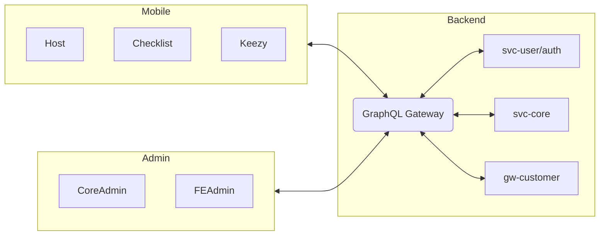

## Mục tiêu

- Xây dựng super app đa dịch vụ (B2C/B2B/B2B2C), mở rộng theo module.
- Trải nghiệm thống nhất, hiệu năng cao, tối ưu chi phí phát triển.

## Phạm vi hiện tại

- Mobile super app (Host + mini-apps) — tài liệu chi tiết ở thư mục `mobile/`.
- Hệ sinh thái trackhub.life: backend (NestJS microservices), admin web, devops stack.

## Lộ trình

- Ngắn hạn: hoàn thiện kiến trúc module, chuẩn hóa SDK chia sẻ, cải thiện CI/CD.
- Dài hạn: thêm marketplace, payment, messaging, loyalty; tách microservices backend.

## Sơ đồ hệ sinh thái (tổng quan)

## Non-functional

- Hiệu năng, độ tin cậy, tuân thủ, khả năng mở rộng; đa môi trường (DEV/QA/PROD).

