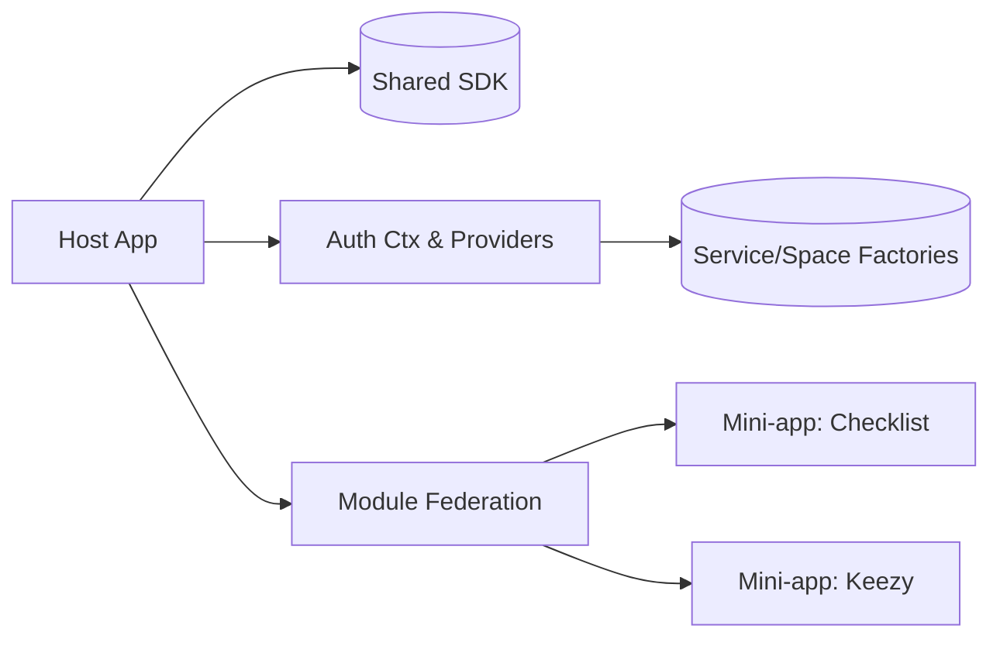

## Vision

- Multi-service super app on mobile, modularized with mini-apps.

## Scope

- Host + mini-apps (`checklist`, `keezy`), shared `auth`, `sdk`.

## High-level Architecture

```mermaid
flowchart LR
  Host[Host App] --> SDK[(Shared SDK)]
  Host --> Auth[Auth Ctx & Providers]
  Host --> MF[Module Federation]
  MF --> Checklist[Mini-app: Checklist]
  MF --> Keezy[Mini-app: Keezy]
  Auth --> Services[(Service/Space Factories)]
```
