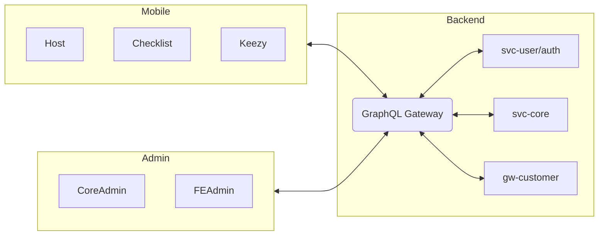

## Objectives

- Build multi-service super app (B2C/B2B/B2B2C), expandable by modules.
- Unified experience, high performance, optimized development costs.

## Current Scope

- Mobile super app (Host + mini-apps) — detailed documentation in `mobile/` folder.
- trackhub.life ecosystem: backend (NestJS microservices), admin web, devops stack.

## Roadmap

- Short-term: complete module architecture, standardize shared SDK, improve CI/CD.
- Long-term: add marketplace, payment, messaging, loyalty; split backend microservices.

## Ecosystem Diagram (overview)

## Non-functional

- Performance, reliability, compliance, scalability; multi-environment (DEV/QA/PROD).
